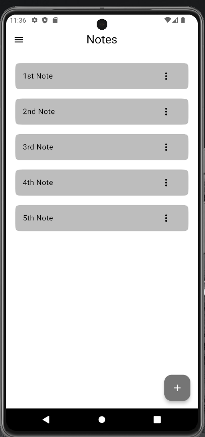
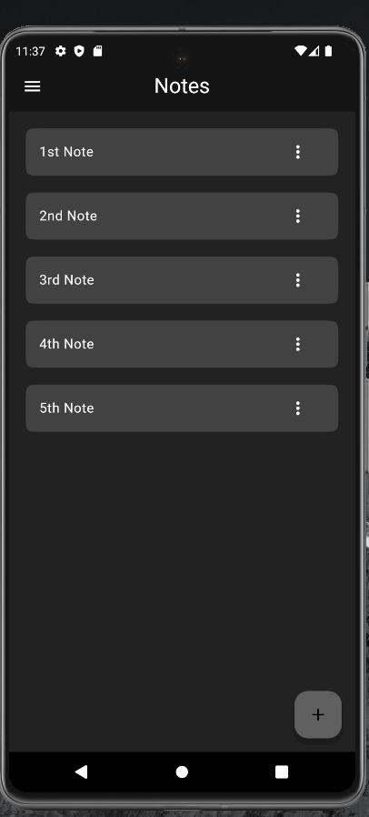
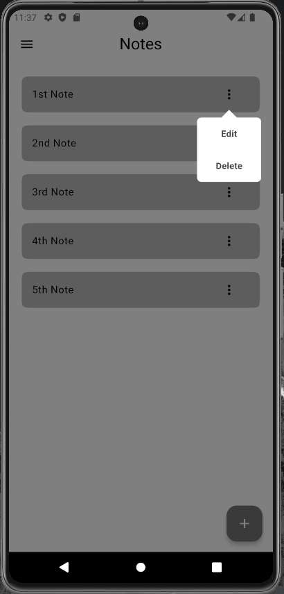
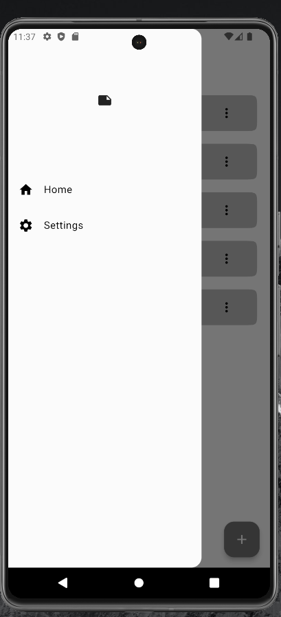

# Notes App 

A Simple Flutter App to learn about how Isar Database works.

This App is built using <a href='https://isar.dev/'>Isar Database</a>.
You can also build this application by using <a href='https://flutter.dev/'>Flutter</a>.

### Screenshots.
 
 

#### Resources
A few resources to get you started if this is your first Flutter project:

- [Lab: Write your first Flutter app](https://docs.flutter.dev/get-started/codelab)
- [Cookbook: Useful Flutter samples](https://docs.flutter.dev/cookbook)

For help getting started with Flutter development, view the
[online documentation](https://docs.flutter.dev/), which offers tutorials,
samples, guidance on mobile development, and a full API reference.
